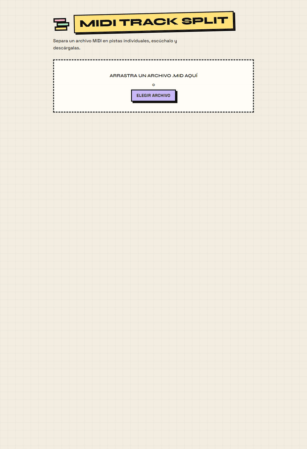

# midi-track-split

App sencilla para separar un archivo MIDI en sus pistas individuales.
Incluye una **CLI** y una **interfaz web** (arrastrar/soltar, reproducción y descarga).

Cada pista de salida es un `.mid` independiente que conserva el mapa global de
la canción (tempo, compás, tonalidad) para que suene igual que el original.



## Requisitos

- Node.js 18 o superior

```bash
npm install
```

## CLI

```bash
node bin/cli.js <entrada.mid> [opciones]
```

| Opción | Descripción |
| --- | --- |
| `-o, --out <carpeta>` | Carpeta de salida (por defecto `<nombre>-tracks`) |
| `-z, --zip [archivo]` | Genera además un `.zip` con todas las pistas |
| `--only-zip [archivo]` | Genera sólo el `.zip` |
| `--include-empty` | Incluye también las pistas sin notas |
| `-h, --help` | Ayuda |

Ejemplos:

```bash
node bin/cli.js sample/demo.mid
node bin/cli.js sample/demo.mid -o pistas --zip
node bin/cli.js sample/demo.mid --only-zip cancion-pistas.zip
```

También se puede enlazar como comando global:

```bash
npm link
midi-track-split cancion.mid --zip
```

## Interfaz web

```bash
npm run web          # http://localhost:4173
npm run web:https    # https://<tu-ip>:4173  (necesario para Web MIDI desde otro equipo)
```

`npm run web:https` genera un certificado autofirmado (cacheado en `.cert/`, con
tu IP local en el certificado); el navegador avisará una vez (Avanzado → Continuar).
Web MIDI **no** funciona por `http://` + IP porque no es contexto seguro.

Abre la URL, arrastra un `.mid`, y podrás:

- escucharlo con el instrumento General MIDI de cada pista (muestras reales;
  la percusión del canal 10 se aproxima con una caja de ritmos TR-808);
- **S** (solo, como en una mesa de mezclas): escuchar solo esa pista; se pueden
  poner varias en solo a la vez; no afecta a la exportación;
- silenciar / activar pistas con el botón **MUTE** de cada fila;
- **localizar una pista**: el botón ▶ de cada fila salta la reproducción al
  instante en que esa pista entra por primera vez (y la desilencia si hacía
  falta); la fila muestra "empieza m:ss" cuando no arranca desde el principio;
- **renombrar** cada pista (clic en su nombre): ese nombre se usa como nombre de
  archivo al descargar el `.mid` y dentro del `.zip`, y también se escribe como
  nombre de pista dentro del propio `.mid`;
- desplazar el punto de reproducción arrastrando la barra o haciendo clic
  (también con ←/→, +Shift = 5 s);
- ver iluminadas en la lista las pistas que están sonando;
- descargar cada pista por separado;
- **MIDI combinado**: descargar un único `.mid` reconstruido a partir del
  original, sin las pistas silenciadas y con los nombres nuevos aplicados;
- **Pistas (.zip)**: descargar todas las pistas separadas en un `.zip`;
- **Enviar a un teclado MIDI externo** (Web MIDI): elegir dispositivo de salida y
  canal (1-16); se envían las notas de las pistas que suenan (respeta mute/solo),
  con opción de silenciar el sintetizador interno. Al parar / pausar / saltar se
  manda *all-notes-off*. Requiere Chrome, Edge u Opera (Safari no lo soporta) y
  conceder el permiso del navegador.

  **Si no pide permiso / no aparece el dispositivo:**
  - Estás por `http://` + IP → no es contexto seguro y la API ni existe. Usa
    `npm run web:https` y entra por `https://…`, o abre `http://localhost:4173` en
    el mismo equipo, o añade el origen en
    `chrome://flags/#unsafely-treat-insecure-origin-as-secure`.
  - Solo se listan **salidas** MIDI. Un controlador que solo *envía* notas (muchos
    teclados master, pads, etc.) no aparece: para oírlo hace falta un aparato con
    generador de sonido o un puerto virtual (loopMIDI) hacia un DAW.
  - Cierra otras apps que tengan el dispositivo abierto y **reinicia el navegador**
    (la detección en caliente a veces falla en Windows). Luego pulsa *Buscar de nuevo*.
  - Comprueba el permiso en `chrome://settings/content/midi`. En **Brave** hay que
    activarlo en `brave://settings/content/midi`.
  - Chrome muestra lo que detecta en `chrome://device-log`.

La interfaz usa un estilo neo-brutalista (colores pastel, bordes y sombras duras)
con las tipografías **Syne** y **Space Grotesk**, e incluye un favicon SVG propio.

## Recursos locales (sin CDN)

Todo vive en el proyecto para no depender de internet:

| Recurso | Dónde | Se regenera con |
| --- | --- | --- |
| Librerías JS (`tone`, `smplr`, `jszip`, `@tonejs/midi`, `midi-file`) | `web/vendor/*.js` (versionado, ~560 KB) | `npm run build:vendor` |
| Fuentes (woff2 + `fonts.css`) | `web/fonts/` (versionado, ~150 KB) | `npm run fetch-fonts` |
| Muestras de instrumentos + batería | `web/soundfonts/` (**no** versionado) | `npm run fetch-sounds` |

`web/vendor/` y `web/fonts/` ya vienen en el repo, así que `npm run web` funciona
sin internet nada más clonar.

Las **muestras de sonido** son pesadas (~2-3 MB por instrumento), así que se
descargan aparte:

```bash
npm run fetch-sounds                 # ~70 instrumentos habituales + batería (~180 MB)
npm run fetch-sounds -- --all        # los 128 instrumentos GM (~300 MB)
npm run fetch-sounds -- flute cello  # solo esos
```

Lo que no esté descargado se coge de un CDN (`gleitz.github.io`) la primera vez
que se usa y el navegador lo cachea. Con `--all` la reproducción es 100% offline.

## Estructura

```
src/split-core.js   Lógica de separación (compartida por CLI y web)
bin/cli.js          Entrada de la CLI
server.js           Servidor estático (HTTP, o HTTPS autofirmado con --https)
web/                Interfaz (HTML + CSS + JS)
web/gm.js           Tablas General MIDI (instrumentos y mapa de percusión)
web/midiout.js      Envío a dispositivo MIDI externo (Web MIDI API)
web/sounds.js       Resuelve muestras locales (web/soundfonts/) o CDN
web/vendor/         Librerías JS empaquetadas (sin CDN)
web/fonts/          Fuentes locales
web/soundfonts/     Muestras descargadas con `npm run fetch-sounds` (no versionado)
scripts/            Build de vendor, descarga de fuentes/sonidos, ejemplo
sample/demo.mid     MIDI de ejemplo (4 pistas con entradas escalonadas)
```

## Cómo funciona la separación

1. Se parsea el MIDI con `midi-file`.
2. Se construye una *pista de conductor* con los eventos globales
   (`setTempo`, `timeSignature`, `keySignature`, ...) de todas las pistas.
3. Por cada pista con notas se escribe un MIDI formato 1 con dos pistas:
   la de conductor y la pista original.

`split-core.js` también expone:

- `sanitizeName(nombre)` — limpia un nombre para usarlo como archivo;
- `renameTrack(bytes, nombre)` — copia del `.mid` con el `trackName` cambiado;
- `mergeMidi(bytes, [{ index, name, muted }])` — reconstruye un único `.mid`
  quitando las pistas silenciadas y renombrando el resto (lo usa "MIDI combinado").

## Créditos

Las muestras de instrumentos vienen de los *soundfonts* de
[MIDI.js / MusyngKite](https://github.com/gleitz/midi-js-soundfonts) y la caja de
ritmos TR-808 de [smpldsnds](https://github.com/smpldsnds/drum-machines),
reproducidas con [smplr](https://github.com/danigb/smplr) sobre
[Tone.js](https://tonejs.github.io/). Tipografías: **Syne** y **Space Grotesk**
(Google Fonts, SIL Open Font License).

## Licencia

[MIT](LICENSE) © Daniel Martínez Sebastián
